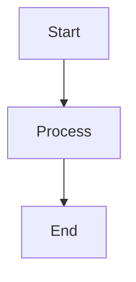
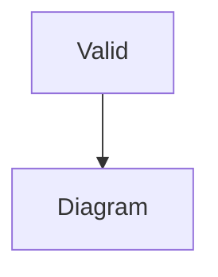

# Indented Mermaid Blocks Test

This document tests various indentation scenarios for Mermaid blocks.

## 1. No Indentation (Standard)



## 2. Two Space Indentation

  ```mermaid
  graph TD
      A[Start] --> B[Process]
      B --> C[End]
  ```

## 3. Four Space Indentation

    ```mermaid
    graph TD
        A[Start] --> B[Process]
        B --> C[End]
    ```

## 4. Tab Indentation

	```mermaid
	graph TD
	    A[Start] --> B[Process]
	    B --> C[End]
	```

## 5. List Context

### Unordered List

- Item 1
  ```mermaid
  graph TD
      A[Item1] --> B[SubItem]
  ```

- Item 2
    ```mermaid
    graph TD
        A[Item2] --> B[SubItem]
    ```

### Ordered List

1. First item
   ```mermaid
   graph TD
       A[First] --> B[Action]
   ```

2. Second item
     ```mermaid
     graph TD
         A[Second] --> B[Action]
     ```

## 6. Nested Structure

> Blockquote with mermaid
> 
> ```mermaid
> graph TD
>     A[Quote] --> B[Content]
> ```

## 7. Complex Diagram with Indentation

  ```mermaid
  sequenceDiagram
      participant Alice
      participant Bob
      Alice->>John: Hello John, how are you?
      loop Healthcheck
          John->>John: Fight against hypochondria
      end
      Note right of John: Rational thoughts <br/>prevail!
      John-->>Alice: Great!
      John->>Bob: How about you?
      Bob-->>John: Jolly good!
  ```

## 8. Invalid Syntax with Indentation

  ```mermaid
  graph TD
      A[Start] -->
  ```

## 9. Mixed Valid and Invalid



  ```mermaid
  graph TD
      C[Invalid -->
  ```

    ```mermaid
    graph TD
        D[Valid] --> E[Again]
    ```