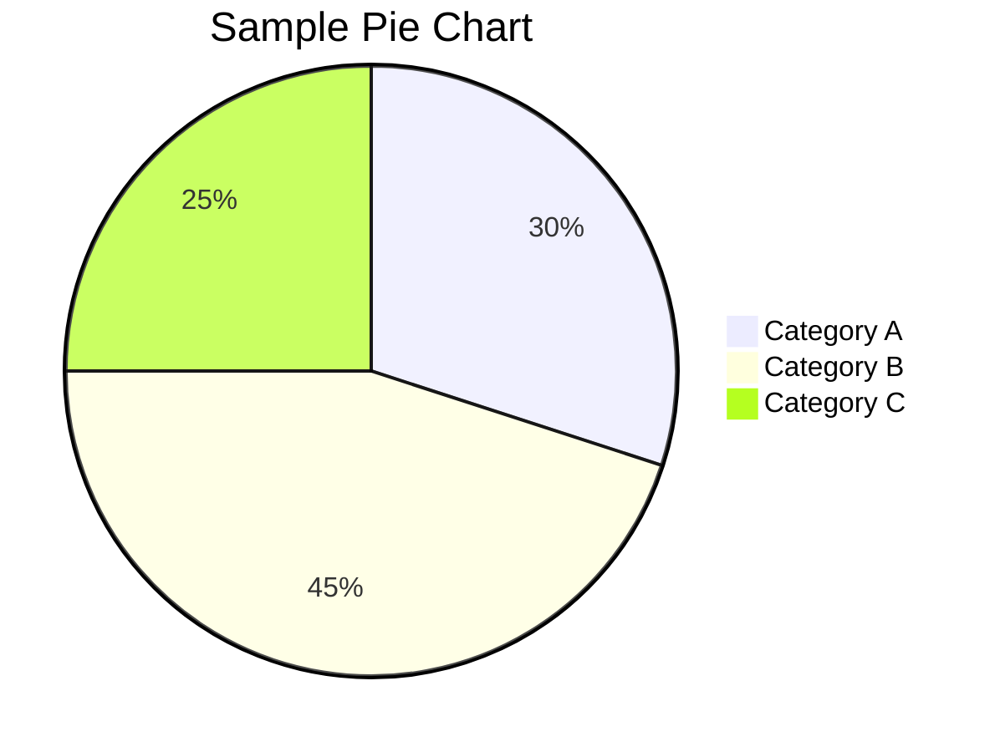
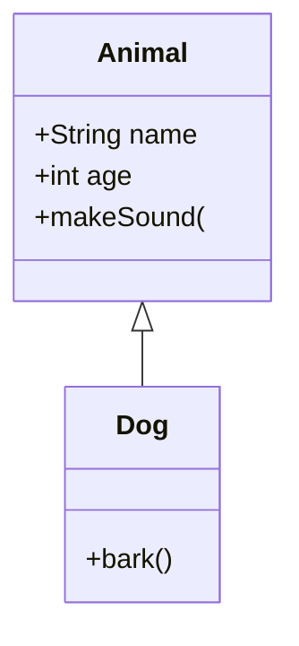

# Mixed Valid and Invalid Diagrams

This document contains both valid and invalid Mermaid diagrams.

## Valid Diagram


## Invalid Diagram

```mermaid
flowchart TB
    A[Start] --> B{Decision
    B -->|Yes| C[Result 1]
    B -->|No| D[Result 2]
    C --> E[End]
    D --> E
```

## Another Valid Diagram



## Another Invalid Diagram



Mixed content with both valid and invalid diagrams.