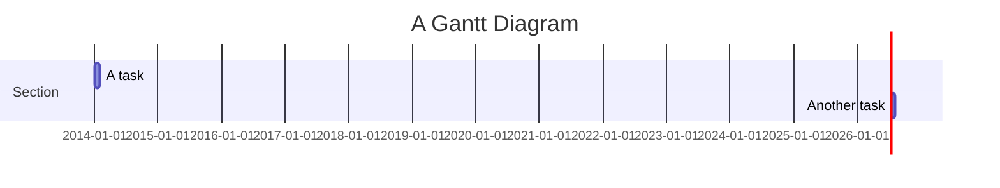

# Multiple Errors Example

This document contains multiple Mermaid diagrams with syntax errors.

## First Error

```mermaid
graph TD
    A[Start --> B[Middle]
    B --> C[End]
```

## Second Error

```mermaid
sequenceDiagram
    participant Alice
    participant Bob
    Alice->>John: Hello John, how are you?
    loop
        John->>John: Missing loop end
    Alice-->>Bob: This line is outside the loop
```

## Third Error



Multiple syntax errors in different diagrams.