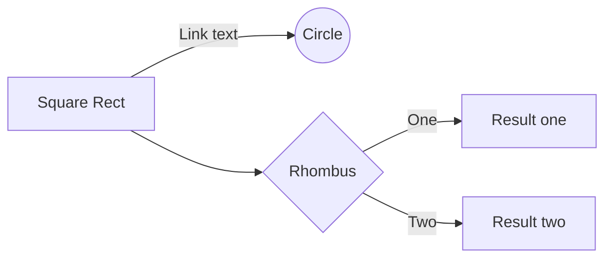
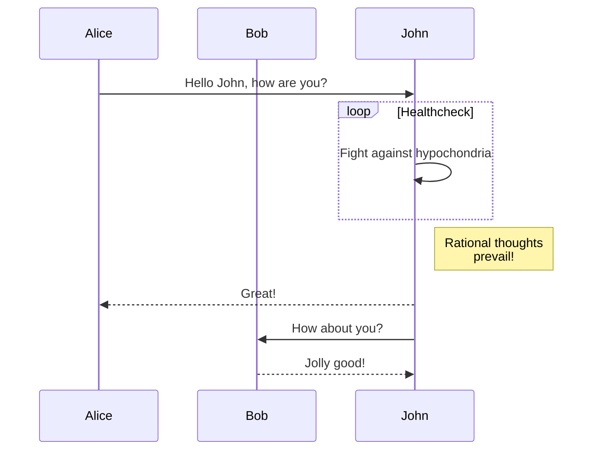
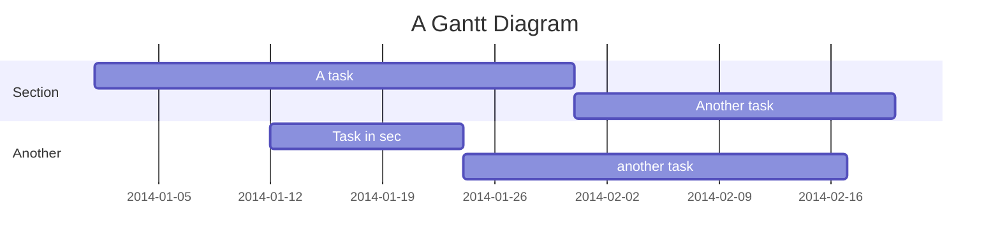

# Multiple Diagrams

This document contains multiple valid Mermaid diagrams.

## Flowchart

```mermaid
flowchart LR
    A[Square Rect] -- Link text --> B((Circle))
    A --> C{Rhombus}
    C -->|One| D[Result one]
    C -->|Two| E[Result two]
```

## Sequence Diagram

```mermaid
sequenceDiagram
    participant Alice
    participant Bob
    Alice->>John: Hello John, how are you?
    loop Healthcheck
        John->>John: Fight against hypochondria
    end
    Note right of John: Rational thoughts <br/>prevail!
    John-->>Alice: Great!
    John->>Bob: How about you?
    Bob-->>John: Jolly good!
```

## Gantt Chart

```mermaid
gantt
    title A Gantt Diagram
    dateFormat  YYYY-MM-DD
    section Section
    A task           :a1, 2014-01-01, 30d
    Another task     :after a1  , 20d
    section Another
    Task in sec      :2014-01-12  , 12d
    another task      : 24d
```

End of document.