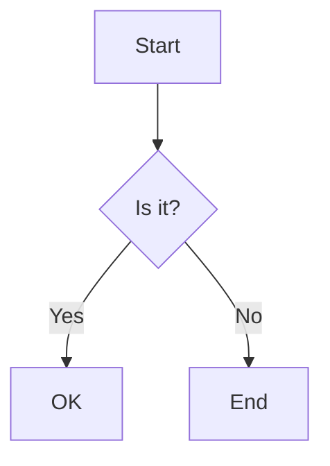

# Simple Flowchart Example

This is a simple example with a valid Mermaid flowchart.

```mermaid
graph TD
    A[Start] --> B{Is it?}
    B -->|Yes| C[OK]
    B -->|No| D[End]
```

Some text after the diagram.